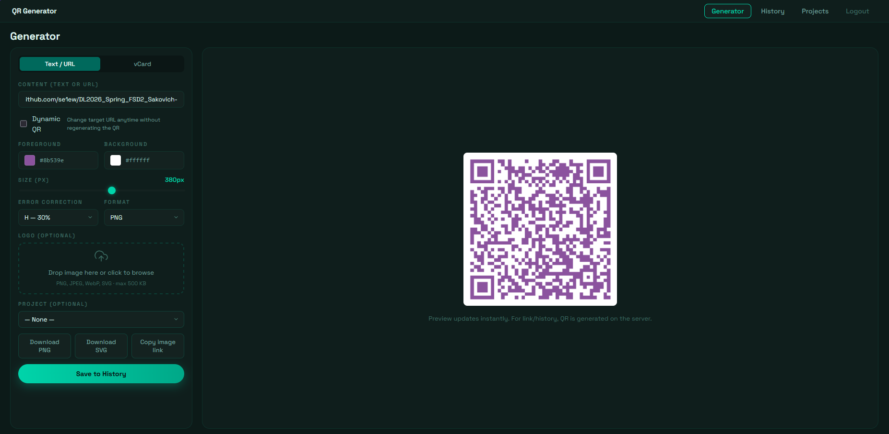
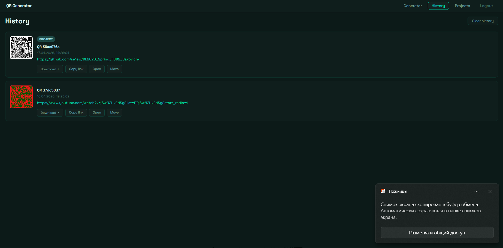
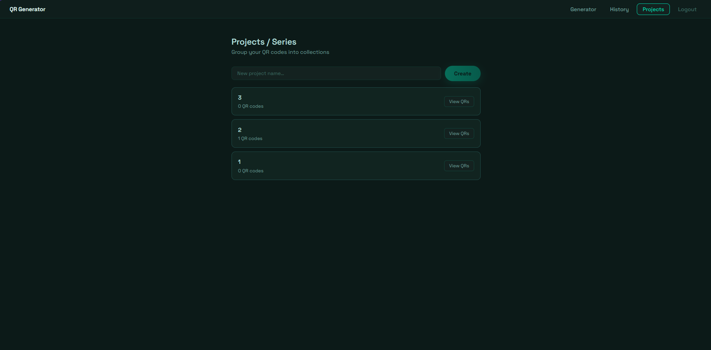

# QR Code Generator

> A modern full-stack QR code generator with real-time analytics, custom styling, dynamic redirects, vCard support, and draggable logo overlay.

## 🚀 Quick Start

```bash
cp backend/.env.example backend/.env   # set JWT_SECRET
docker compose up --build
```

Open **http://localhost:5173** — register and start generating.

---

## 📸 Preview

| Generator | History | Projects |
|---|---|---|
|  |  |  |

> No screenshots yet? Run the app and add them to `docs/screenshots/`.

---

## 🌐 Architecture

```
Browser (React SPA)
        │  REST + WebSocket
        ▼
  Express API  ──── Redis (cache + views)
        │
   Prisma ORM
        │
   PostgreSQL
```

**Request flow:**
1. `POST /api/qr` → validate (Zod) → generate image (qrcode lib) → save to DB → invalidate Redis cache → emit Socket.IO event
2. `GET /api/qr` → check Redis cache → on miss: DB query → cache result
3. `GET /r/:id` → DB lookup `dynamicUrl` → `302 redirect`

---

## 🛠 Tech Stack

| Layer | Technologies |
|---|---|
| **Frontend** | React 18, TypeScript, Vite, React Konva, react-colorful |
| **Backend** | Node.js 20, Express 5, TypeScript, Zod |
| **Database** | PostgreSQL 16 + Prisma ORM |
| **Cache** | Redis 7 (ioredis) |
| **Realtime** | Socket.IO (WebSocket) |
| **Auth** | JWT (access) + refresh tokens (DB rotation) |
| **Infrastructure** | Docker, docker-compose |
| **Quality** | ESLint, Prettier, Vitest, Jest |
| **Security** | Helmet.js, express-rate-limit |
| **Logging** | Morgan |

## 🤔 Why this stack?

**Why React Konva?**  
The logo overlay feature requires a draggable, resizable element positioned on top of the QR canvas. Konva provides a 2D canvas abstraction with built-in drag/resize transformers. The alternative (plain SVG + pointer events) would require ~200 lines of manual hit-testing and transform math — Konva handles it in 20 lines.

**Why Redis for view counts instead of PostgreSQL?**  
View counts are incremented on every public QR scan (`INCR qr:views:{id}`). An atomic Redis `INCR` takes ~0.1ms with no locking, vs a PostgreSQL `UPDATE ... SET views = views + 1` which requires a row lock. At scale, counter increments would create lock contention on hot rows.

**Why `Promise.allSettled` for history pagination?**  
`COUNT(*)` and `findMany` are independent queries. If the count query fails (e.g. timeout), `allSettled` still returns the items — pagination degrades gracefully instead of returning 500.

**Why offset pagination instead of cursor?**  
The history page has low cardinality per user (< 1000 QR codes typical) and the user always starts from page 1. Offset pagination is simpler and acceptable at this scale. Cursor-based would be needed at 100k+ records per user.

## ✨ Features

### QR Generator
- PNG and SVG output — generated in parallel via `Promise.allSettled`
- Configurable color, background, error correction level (L/M/Q/H), margin, size
- Live preview on every parameter change

### Logo Overlay
- Drag-and-drop or file picker logo upload
- Draggable + resizable logo positioned over the QR (powered by React Konva)
- Auto-constrained — logo cannot cover the QR finder patterns

### History
- Paginated QR history (6 per page)
- Download (PNG / SVG), copy public link, delete

### Realtime Analytics
- Public link per QR (`/api/qr/:id/view`) — no auth required
- View counter stored in Redis; owner gets a WebSocket notification on each scan

### vCard QR codes
- Mode toggle: **Text/URL** or **vCard** (business card)
- Fill name, org, phone, email, website → auto-generates vCard 3.0 string
- Scan with any phone camera → "Save contact" prompt

### Dynamic QR codes
- Enable **Dynamic QR** at creation — the QR encodes `/r/:id`, not the final URL
- Change the target URL anytime via **Edit target** in History
- `GET /r/:id` performs a `302` redirect to the current `dynamicUrl`

### Projects / Series
- Create named collections and group QR codes into them
- Assign at creation via dropdown, or move later from History
- **View QRs** modal per project — add/remove QR codes inline

## 🏛 Architectural Decisions

| Pattern | Where & Why |
|---|---|
| `AbortController` | Cancels in-flight fetch on component unmount or re-submit — prevents stale state updates |
| Rate limiting | `express-rate-limit`: 20 req/15 min on auth, 30 req/min on QR creation |
| Refresh token rotation | `crypto.randomBytes(40)`, stored in DB, TTL 30 days; old token deleted on each use |
| `Promise.allSettled` | Parallel `COUNT` + `findMany` for pagination — count failure degrades gracefully |
| `Cache-Control: no-store` | All private/mutating endpoints |
| `Cache-Control: public, max-age=60` | Public QR view page |
| Redis per-page cache | History cached per `page × limit` combo; invalidated by pattern `qr:history:{uid}:*` |
| Git Flow | `main` ← `develop` ← `feature/*`; all merges via `--no-ff` |

## 📁 Project Structure

```
.
├── backend/
│   ├── prisma/             # Schema + migrations
│   └── src/
│       ├── controllers/    # Request handlers
│       ├── middleware/     # auth, validate, rateLimit, cache, errorHandler
│       ├── lib/            # prisma client, redis client, Socket.IO
│       ├── routes/         # Express routers
│       ├── services/       # Business logic (qrService, projectService, userService)
│       └── types/          # Zod schemas + inferred types
├── frontend/
│   └── src/
│       ├── components/     # QrPreviewStage, ColorPicker, VCardForm, ProjectQrModal
│       ├── hooks/          # useAuth, useProjects
│       ├── pages/          # HistoryPage, ProjectsPage
│       └── types/          # QrHistoryItem, Project
└── docker-compose.yml
```

## 🧪 Tests

```bash
npm test --workspace=backend   # Jest: qrService, Zod schemas
npm test --workspace=frontend  # Vitest: constrainLogoPos, validateQrForm
```

CI runs automatically via GitHub Actions on every push to `main`, `develop`, `feature/*`.

## ▶ Running Locally

### Docker (recommended)

```bash
cp backend/.env.example backend/.env  # set JWT_SECRET
docker compose up --build
```

| Service | URL |
|---|---|
| Frontend | http://localhost:5173 |
| Backend API | http://localhost:3000 |
| PostgreSQL | localhost:5432 |
| Redis | localhost:6379 |

### Dev mode (without Docker)

```bash
# Start infra only
docker compose up postgres redis -d

# Backend
cd backend && cp .env.example .env
npm install && npx prisma migrate dev && npm run dev   # :3000

# Frontend (separate terminal)
cd frontend && npm install && npm run dev              # :5173
```

## ⚙️ Environment Variables

### `backend/.env`

| Variable | Default | Description |
|---|---|---|
| `DATABASE_URL` | — | PostgreSQL connection string |
| `JWT_SECRET` | — | JWT signing secret |
| `JWT_EXPIRES_IN` | `7d` | Access token lifetime |
| `REDIS_URL` | `redis://localhost:6379` | Redis connection URL |
| `REDIS_HISTORY_TTL` | `60` | History cache TTL (seconds) |
| `CORS_ORIGIN` | `http://localhost:5173` | Allowed CORS origin |
| `PORT` | `3000` | HTTP server port |

### `frontend/.env`

| Variable | Default | Description |
|---|---|---|
| `VITE_API_URL` | `http://localhost:3000` | Backend base URL |

## 📡 API Reference

| Method | Path | Auth | Description |
|---|---|---|---|
| `POST` | `/api/auth/register` | — | Register new user |
| `POST` | `/api/auth/login` | — | Login, returns `token` + `refreshToken` |
| `GET` | `/api/auth/me` | ✓ | Verify token, return user |
| `POST` | `/api/auth/refresh` | — | Exchange refresh token for new access token |
| `POST` | `/api/auth/logout` | — | Revoke refresh token |
| `POST` | `/api/qr` | ✓ | Create QR code |
| `GET` | `/api/qr?page=1&limit=6` | ✓ | Paginated history |
| `GET` | `/api/qr?projectId=uuid` | ✓ | History filtered by project |
| `GET` | `/api/qr/:id` | ✓ | Get single QR |
| `PATCH` | `/api/qr/:id` | ✓ | Update `dynamicUrl` or `projectId` |
| `DELETE` | `/api/qr/:id` | ✓ | Delete QR |
| `GET` | `/api/qr/:id/view` | — | Public view page (increments counter) |
| `GET` | `/r/:id` | — | Dynamic QR redirect → `302` to `dynamicUrl` |
| `GET` | `/api/projects` | ✓ | List user projects |
| `POST` | `/api/projects` | ✓ | Create project |
| `DELETE` | `/api/projects/:id` | ✓ | Delete project |
| `GET` | `/health` | — | Health check |

### Examples

**Register / Login**
```http
POST /api/auth/login
Content-Type: application/json

{ "email": "user@example.com", "password": "secret123" }
```
```json
{
  "token": "eyJhbGci...",
  "refreshToken": "a3f9b2...",
  "user": { "id": "uuid", "email": "user@example.com" }
}
```

**Create QR code**
```http
POST /api/qr
Authorization: Bearer <token>
Content-Type: application/json

{
  "text": "https://example.com",
  "format": "png",
  "size": 300,
  "color": "#000000",
  "background": "#ffffff",
  "errorCorrectionLevel": "M",
  "margin": 2,
  "dynamic": true,
  "dynamicUrl": "https://example.com",
  "projectId": "uuid-optional"
}
```
```json
{
  "qr": {
    "id": "uuid",
    "data": "https://example.com",
    "dynamicUrl": "https://example.com",
    "projectId": null,
    "createdAt": "2024-01-01T00:00:00.000Z"
  },
  "image": "data:image/png;base64,...",
  "mimeType": "image/png"
}
```

**Update dynamic URL**
```http
PATCH /api/qr/:id
Authorization: Bearer <token>
Content-Type: application/json

{ "dynamicUrl": "https://new-destination.com" }
```

**Paginated history**
```http
GET /api/qr?page=1&limit=6&projectId=uuid
Authorization: Bearer <token>
```
```json
{
  "items": [ { "id": "...", "data": "...", "imageUrl": "..." } ],
  "total": 42,
  "page": 1,
  "limit": 6,
  "totalPages": 7
}
```
