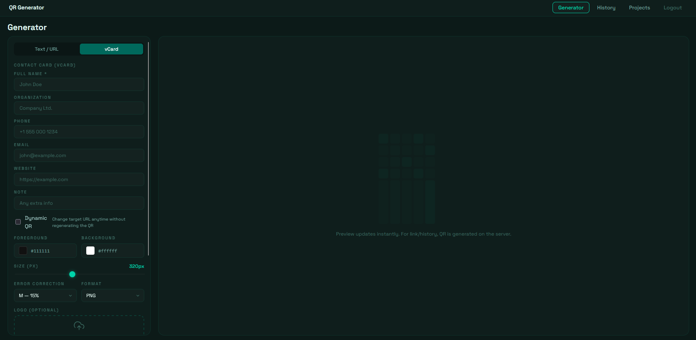
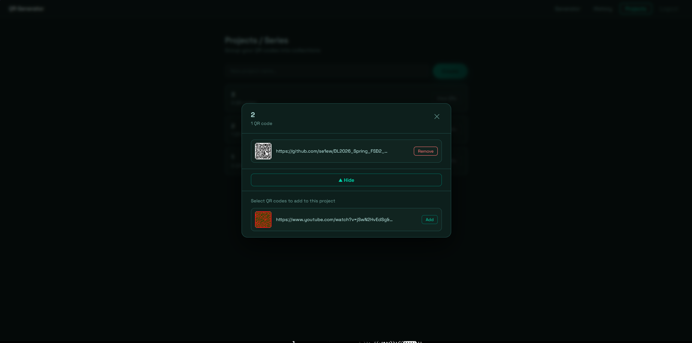

# QR Code Generator

> Современный full-stack генератор QR-кодов с аналитикой в реальном времени, кастомизацией внешнего вида, динамическими редиректами, поддержкой vCard и перетаскиваемым логотипом.

## 🚀 Быстрый старт

```bash
cp backend/.env.example backend/.env   # задать JWT_SECRET
docker compose up --build
```

Открыть **http://localhost:5173** — зарегистрироваться и начать генерировать.

---

## 📸 Скриншоты

| Генератор | История | Проекты |
|---|---|---|
|  |  |  |

| vCard режим | Модальное окно проекта |
|---|---|
|  |  |

---

## 🌐 Архитектура

```
Браузер (React SPA)
        │  REST + WebSocket
        ▼
  Express API  ──── Redis (кэш + счётчики просмотров)
        │
   Prisma ORM
        │
   PostgreSQL
```

**Поток запросов:**
1. `POST /api/qr` → валидация (Zod) → генерация изображения → сохранение в БД → инвалидация Redis-кэша → событие Socket.IO
2. `GET /api/qr` → проверка Redis-кэша → при промахе: запрос в БД → кэширование результата
3. `GET /r/:id` → поиск `dynamicUrl` в БД → `302 redirect`

---

## 🛠 Технологический стек

| Слой | Технологии |
|---|---|
| **Фронтенд** | React 18, TypeScript, Vite, React Konva, react-colorful |
| **Бэкенд** | Node.js 20, Express 5, TypeScript, Zod |
| **База данных** | PostgreSQL 16 + Prisma ORM |
| **Кэш** | Redis 7 (ioredis) |
| **Реалтайм** | Socket.IO (WebSocket) |
| **Авторизация** | JWT (access) + refresh-токены (ротация в БД) |
| **Инфраструктура** | Docker, docker-compose |
| **Качество кода** | ESLint, Prettier, Vitest, Jest |
| **Безопасность** | Helmet.js, express-rate-limit |
| **Логирование** | Morgan |

## ✨ Возможности

### Генератор QR-кодов
- Генерация в форматах **PNG** и **SVG** — параллельно через `Promise.allSettled`
- Настройка цвета, фона, уровня коррекции ошибок (L/M/Q/H), отступа, размера
- Live preview обновляется при каждом изменении параметров

### Логотип
- Загрузка через drag-and-drop или выбор файла
- Перетаскивание и ресайз логотипа поверх QR (React Konva)
- Автоограничение позиции — логотип не может перекрыть угловые маркеры QR

### История
- Пагинированная история QR-кодов (6 на страницу)
- Скачивание (PNG / SVG), копирование публичной ссылки, удаление

### Реалтайм-аналитика
- Публичная ссылка на каждый QR (`/api/qr/:id/view`) — без авторизации
- Счётчик просмотров в Redis; владелец получает WebSocket-уведомление при каждом сканировании

### vCard QR-коды
- Переключатель режима: **Текст/URL** или **vCard** (визитка)
- Заполнение полей (имя, организация, телефон, email, сайт) → автогенерация строки vCard 3.0
- Сканирование камерой телефона → предложение «Сохранить контакт»

### Динамические QR-коды
- Чекбокс «Динамический QR» при создании — QR кодирует `/r/:id`, а не конечный адрес
- Целевой URL можно менять в любое время через кнопку **Edit target** в истории
- `GET /r/:id` выполняет `302`-редирект на актуальный `dynamicUrl`

### Проекты / Серии
- Создание именованных коллекций и группировка QR-кодов
- Привязка при создании через выпадающий список или перенос из истории
- Модальное окно **«View QRs»** для каждого проекта — добавление/удаление QR inline

## 🏛 Архитектурные решения

| Паттерн | Где и зачем |
|---|---|
| `AbortController` | Отмена in-flight запросов при размонтировании компонента или повторном сабмите |
| Rate limiting | `express-rate-limit`: 20 req/15 мин на auth, 30 req/мин на создание QR |
| Ротация refresh-токенов | `crypto.randomBytes(40)`, хранится в БД, TTL 30 дней; старый токен удаляется при каждом использовании |
| `Promise.allSettled` | Параллельный `COUNT` + `findMany` в пагинации — ошибка count не ломает ответ |
| `Cache-Control: no-store` | Все приватные и мутирующие эндпоинты |
| `Cache-Control: public, max-age=60` | Публичная страница просмотра QR |
| Redis per-page cache | История кэшируется на каждую комбинацию `page × limit`; инвалидация по паттерну `qr:history:{uid}:*` |
| Git Flow | `main` ← `develop` ← `feature/*`; все слияния через `--no-ff` |

## 📁 Структура проекта

```
.
├── backend/
│   ├── prisma/             # Схема и миграции
│   └── src/
│       ├── controllers/    # Обработчики запросов
│       ├── middleware/     # auth, validate, rateLimit, cache, errorHandler
│       ├── lib/            # Prisma client, Redis client, Socket.IO
│       ├── routes/         # Express-роутеры
│       ├── services/       # Бизнес-логика (qrService, projectService, userService)
│       └── types/          # Zod-схемы и выведенные типы
├── frontend/
│   └── src/
│       ├── components/     # QrPreviewStage, ColorPicker, VCardForm, ProjectQrModal
│       ├── hooks/          # useAuth, useProjects
│       ├── pages/          # HistoryPage, ProjectsPage
│       └── types/          # QrHistoryItem, Project
└── docker-compose.yml
```

## 🧪 Тесты

```bash
npm test --workspace=backend   # Jest: qrService, Zod-схемы
npm test --workspace=frontend  # Vitest: constrainLogoPos, validateQrForm
```

CI запускается автоматически через GitHub Actions при каждом push в `main`, `develop`, `feature/*`.

## ▶ Запуск

### Docker (рекомендуется)

```bash
cp backend/.env.example backend/.env  # задать JWT_SECRET
docker compose up --build
```

| Сервис | URL |
|---|---|
| Фронтенд | http://localhost:5173 |
| Backend API | http://localhost:3000 |
| PostgreSQL | localhost:5432 |
| Redis | localhost:6379 |

### Локальная разработка (без Docker)

```bash
# Только инфраструктура
docker compose up postgres redis -d

# Бэкенд
cd backend && cp .env.example .env
npm install && npx prisma migrate dev && npm run dev   # :3000

# Фронтенд (отдельный терминал)
cd frontend && npm install && npm run dev              # :5173
```

## ⚙️ Переменные окружения

### `backend/.env`

| Переменная | По умолчанию | Описание |
|---|---|---|
| `DATABASE_URL` | — | Строка подключения к PostgreSQL |
| `JWT_SECRET` | — | Секрет для подписи JWT |
| `JWT_EXPIRES_IN` | `7d` | Время жизни access-токена |
| `REDIS_URL` | `redis://localhost:6379` | URL Redis |
| `REDIS_HISTORY_TTL` | `60` | TTL кэша истории (секунды) |
| `CORS_ORIGIN` | `http://localhost:5173` | Разрешённый CORS-origin |
| `PORT` | `3000` | Порт HTTP-сервера |

### `frontend/.env`

| Переменная | По умолчанию | Описание |
|---|---|---|
| `VITE_API_URL` | `http://localhost:3000` | Базовый URL бэкенда |

## 📡 API

| Метод | Путь | Auth | Описание |
|---|---|---|---|
| `POST` | `/api/auth/register` | — | Регистрация |
| `POST` | `/api/auth/login` | — | Вход, возвращает `token` + `refreshToken` |
| `GET` | `/api/auth/me` | ✓ | Проверка токена, возврат пользователя |
| `POST` | `/api/auth/refresh` | — | Обмен refresh-токена на новый access |
| `POST` | `/api/auth/logout` | — | Отзыв refresh-токена |
| `POST` | `/api/qr` | ✓ | Создать QR-код |
| `GET` | `/api/qr?page=1&limit=6` | ✓ | Пагинированная история |
| `GET` | `/api/qr?projectId=uuid` | ✓ | История с фильтром по проекту |
| `GET` | `/api/qr/:id` | ✓ | Получить QR по ID |
| `PATCH` | `/api/qr/:id` | ✓ | Обновить `dynamicUrl` или `projectId` |
| `DELETE` | `/api/qr/:id` | ✓ | Удалить QR |
| `GET` | `/api/qr/:id/view` | — | Публичный просмотр (счётчик++) |
| `GET` | `/r/:id` | — | Редирект динамического QR → `302` на `dynamicUrl` |
| `GET` | `/api/projects` | ✓ | Список проектов пользователя |
| `POST` | `/api/projects` | ✓ | Создать проект |
| `DELETE` | `/api/projects/:id` | ✓ | Удалить проект |
| `GET` | `/health` | — | Healthcheck |

### Примеры запросов

**Вход**
```http
POST /api/auth/login
Content-Type: application/json

{ "email": "user@example.com", "password": "secret123" }
```
```json
{
  "token": "eyJhbGci...",
  "refreshToken": "a3f9b2...",
  "user": { "id": "uuid", "email": "user@example.com" }
}
```

**Создание QR-кода**
```http
POST /api/qr
Authorization: Bearer <token>
Content-Type: application/json

{
  "text": "https://example.com",
  "format": "png",
  "size": 300,
  "color": "#000000",
  "background": "#ffffff",
  "errorCorrectionLevel": "M",
  "margin": 2,
  "dynamic": true,
  "dynamicUrl": "https://example.com",
  "projectId": "uuid-опционально"
}
```
```json
{
  "qr": {
    "id": "uuid",
    "data": "https://example.com",
    "dynamicUrl": "https://example.com",
    "projectId": null,
    "createdAt": "2024-01-01T00:00:00.000Z"
  },
  "image": "data:image/png;base64,...",
  "mimeType": "image/png"
}
```

**Обновление динамического URL**
```http
PATCH /api/qr/:id
Authorization: Bearer <token>
Content-Type: application/json

{ "dynamicUrl": "https://новый-адрес.com" }
```

**Пагинированная история**
```http
GET /api/qr?page=1&limit=6&projectId=uuid
Authorization: Bearer <token>
```
```json
{
  "items": [ { "id": "...", "data": "...", "imageUrl": "..." } ],
  "total": 42,
  "page": 1,
  "limit": 6,
  "totalPages": 7
}
```
